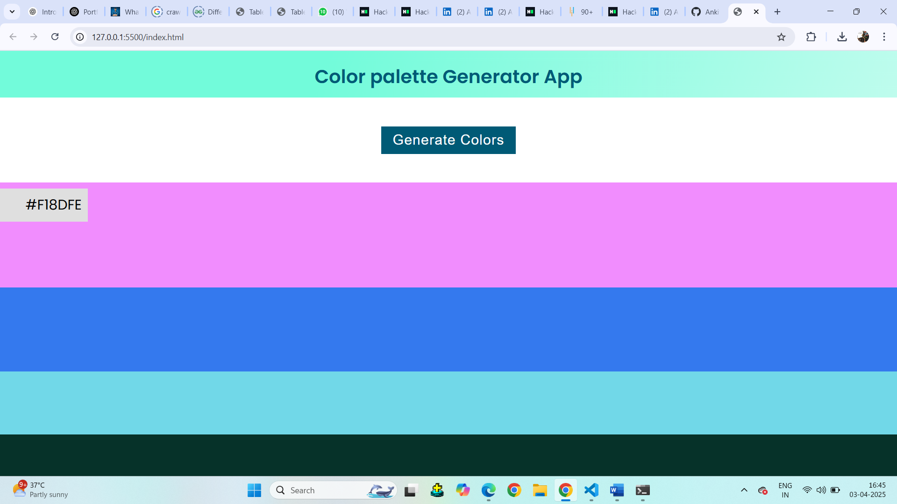
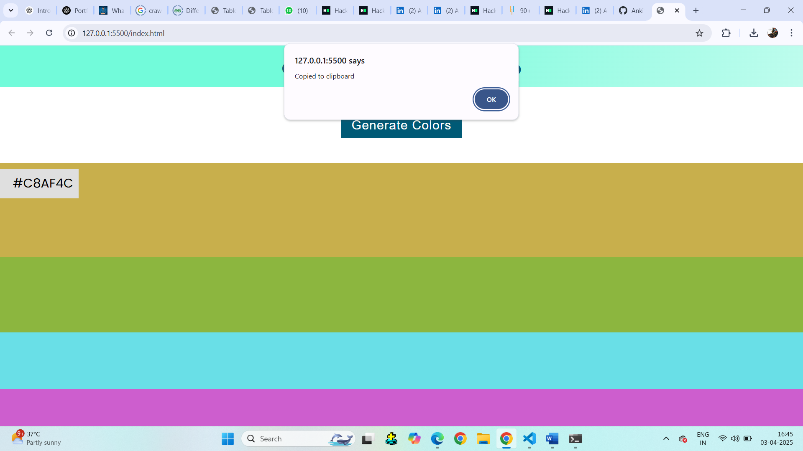
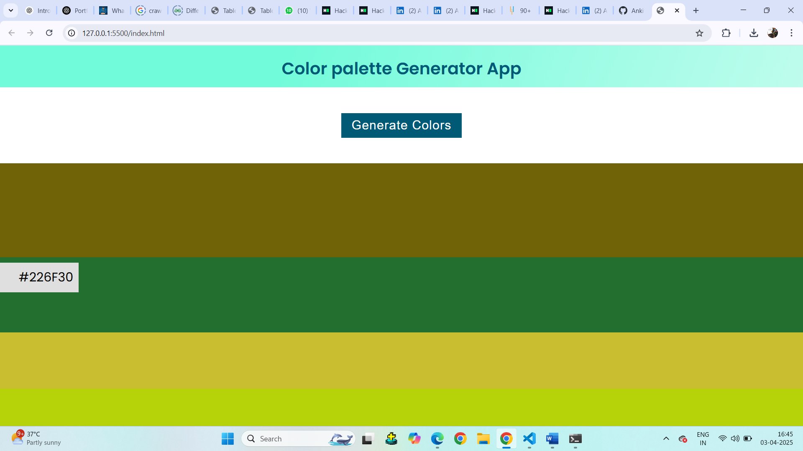

🎨 Color Code Generator
A powerful, minimalistic, and user-friendly Color Code Generator that instantly generates random colors with HEX, RGB, and HSL values. Copy colors with a single click! 🚀

🎨 A sleek and responsive color generator in action!

🌟 Features
✅ Generate random colors effortlessly
✅ Copy HEX, RGB, and HSL color codes in one click
✅ Fully responsive—works on mobile & desktop
✅ Dark & Light Mode support 🌙☀️

git clone https://github.com/AnkitKumar0907/Color-code-Generator.git

cd color-code-generator

2️⃣ Open in Your Browser
Simply open index.html in Chrome, Firefox, Edge, or any modern browser:

sh
Copy
Open index.html
3️⃣ Start Generating Colors! 🎨
🖥️ Technologies Used
HTML5 🌐 - Structuring the application

CSS3 🎨 - Styling & responsive design

JavaScript (ES6+) ⚡ - Core functionality & event handling

📸 Screenshots
Light Mode	Dark Mode
🎨 A visually stunning and easy-to-use color generator!

🛠️ How It Works
Click "Generate" → Get a random color instantly

Copy the HEX, RGB, or HSL code → Just click on the code

Use the color in your designs, websites, or projects! 🎨

📌 Contributing
🙌 Want to improve this project? Contributions are welcome!

Open a Pull Request 🚀

🚀 Ready to Create Stunning Color Palettes? Start Generating Now! 🎨
🔹 ✅ Uses SEO-friendly keywords (Color Code Generator, HEX, RGB, HSL)
✅ Well-structured with headings & bullet points
✅ Readable and visually appealing
✅ Uses Markdown best practices

Upload your image

2️⃣ PostImages (No sign-up required)

📌 Adding an Image in README

 🚀😊

 🚀😊

